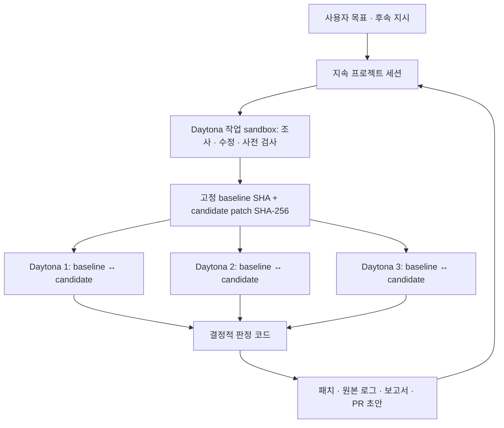

# AgenticRocket

### One project. One agent session. Measured improvements.

**코드를 고치는 데서 끝나지 않고, 개선을 검증하고 다음 실험까지 이어가는 AI 성능 엔지니어.**

AgenticRocket은 프로젝트 조사, 실제 코드 수정, correctness 검사, 반복 성능 측정을 하나의 지속 세션으로 연결합니다. 사용자가 받는 것은 최적화에 대한 설명만이 아닙니다. **실제로 적용할 패치와, 바로 그 패치를 검증한 실행 근거**입니다.

[라이브 데모](https://jungwuk.jungwuk.com) · [실제 실행 기록](app/docs/verification-2026-09-19.md) · [실행·운영 가이드](app/README.md) · [데모 대상 저장소](https://github.com/jungwuk-ryu/agenticrocket-demo-perf)

> A persistent optimization agent that turns code changes into evidence-backed decisions. One frozen patch, three paired Daytona sandbox measurements, and a verdict computed from execution data—not written by the model.

## 해결하려는 문제

“이 코드가 더 빠릅니다”라는 제안과, 실제로 채택할 수 있는 변경 사이에는 일이 많이 남습니다. 원래 동작이 유지되는지 확인하고, 같은 조건으로 측정하고, 일시적인 노이즈를 구분하고, 수정본과 결과가 일치하는지 검토해야 합니다. 실패하거나 대화가 길어지면 이전 실험을 다시 설명해야 하는 부담도 생깁니다.

AgenticRocket은 이 과정을 하나의 작업 흐름으로 묶습니다. 목표를 맡기면 에이전트가 Daytona에서 저장소를 읽고 수정하며, 서비스가 고정된 기준으로 그 변경을 검증합니다. 사용자는 **왜 바뀌었는지, 무엇을 실행했는지, 결과를 어디까지 신뢰할 수 있는지** 확인하고 다음 행동을 결정합니다.

## 무엇이 혁신적인가

### 1. 대화가 아니라 프로젝트의 작업 상태를 이어갑니다

세션은 메시지 목록 이상입니다. 목표, baseline commit, 작업 sandbox, 실제 diff, 후보 patch의 지문, 실패 이력, 실행 중인 command ID를 함께 보존합니다.

- “이 패치로 다시 측정해줘”는 기존 패치로 새 검증을 실행합니다.
- “왜 빨라졌어?”는 해당 변경과 측정 근거를 읽어 설명합니다.
- 서버가 재시작되면 미완료 작업을 `interrupted`로 표시하고, 사용자가 Resume할 때 저장된 외부 실행 상태를 확인합니다.
- Context compaction 뒤에도 checkpoint와 원본 로그를 다시 읽을 수 있습니다.

**사용자가 실험의 맥락을 매번 복원하지 않아도, 같은 세션에서 다음 일을 맡길 수 있습니다.** 공개 데모의 자유형 후속 채팅은 악의적 사용 방지를 위해 관리자에게만 허용합니다.

### 2. 코드를 제안하는 모델과, 통과를 결정하는 검증 코드를 분리합니다

모델은 소스를 조사하고 가설을 세워 수정합니다. 테스트·benchmark·workload·빌드 조건과 최종 판정은 서비스 코드가 관리합니다. 검증 기준을 바꾸는 패치는 허용하지 않습니다.

| 검증에서 놓치기 쉬운 문제 | AgenticRocket의 실행 경계 |
| --- | --- |
| 수정한 코드와 측정한 코드가 다름 | baseline SHA와 패치 SHA-256으로 후보·측정·다운로드 연결 |
| 명령 성공을 동작 보존으로 오인 | 동일 테스트, CLI 출력, benchmark checksum 비교 |
| 실행 환경 준비 시간을 성능으로 보고 | benchmark 자체의 `median_ms`만 사용 |
| 한 번 잘 나온 결과를 채택 | 세 sandbox에서 양쪽 warm-up 후 순서를 섞어 반복 측정 |
| 변동이 큰 수치도 성공으로 표시 | 양쪽 변동성·최소 효과 기준으로 `inconclusive` 판정 |

**모델이 “성공”이라고 말해서 통과하는 구조가 아닙니다.** 검증 결과를 계산하는 코드는 [project.mjs](app/server/lib/project.mjs)와 [verdict.mjs](app/server/lib/verdict.mjs)에서 직접 확인할 수 있습니다.

### 3. Daytona를 작업 공간과 검증 공간으로 나눠 사용합니다

하나의 작업 sandbox에서는 같은 에이전트가 조사와 수정을 이어갑니다. 검증할 때는 후보를 고정하고, 별도의 Daytona sandbox 세 개가 **각각 같은 환경 안에서 원본과 후보를 비교**합니다. 세 worker는 서로 다른 코드를 만드는 에이전트가 아니라 동일 후보를 측정하는 실행 단위입니다.



측정이 끝난 sandbox는 증거를 회수한 뒤 삭제하고, 작업 sandbox는 후속 작업을 위해 정지·보존합니다. 별도 sandbox가 서로 다른 물리 호스트임을 보장한다고 주장하지 않습니다.

## 실제로 완주한 결과

2026-09-19, C++17 로그 분석 프로젝트 PulseLog를 실제 Daytona에서 실행했습니다. 에이전트는 `normalize_route`가 레코드마다 정규식 객체를 다시 생성하는 부분을 함수 내부의 `static const` 객체로 바꿨습니다.

| 동일 패치에 대한 실행 | 관측 결과 | 서비스 판정 |
| --- | --- | --- |
| 첫 검증: 세 sandbox의 paired 측정 | 고정 workload에서 집계 실행 시간 **98.56% 감소**, correctness 검사 통과 | `verified` |
| 같은 세션에서 후속 재측정 | 세 번째 환경의 baseline 변동계수 약 **15.74%**, 허용 한도 8% 초과 | `inconclusive` |

**두 번째 결과도 남겼습니다.** 큰 감소율이 관측됐더라도 측정이 불안정하면 검증된 개선으로 승격하지 않습니다. 첫 보고서와 후속 보고서를 모두 보존하며, 현재 결과는 후속 실행의 `inconclusive`입니다.

검증한 패치의 SHA-256:

```text
c0e875fb04b66b14222593d6ec8ef882e851a89feb93740a56ada8522ba3eed1
```

수치는 6,000개 레코드·benchmark 내부 3회 반복이라는 **해당 데모 workload에 한정된 실행 시간 감소율**입니다. 모든 프로젝트의 성능, 처리량 증가율, 모델 응답 시간 개선을 뜻하지 않습니다. sandbox별 원본 수치, baseline SHA, 실행 ID, 재시작·취소 검증은 [실제 실행 기록](app/docs/verification-2026-09-19.md)에 공개했습니다.

### 판정 기준도 결과와 함께 남깁니다

- 양쪽 warm-up 후 `baseline → candidate → candidate → baseline → baseline → candidate` 순서로 실행합니다.
- 각 측정은 benchmark의 native median이며, 양쪽 각각 세 측정값의 평균을 대표 시간으로 사용합니다.
- 집계 감소율은 세 sandbox의 실행 시간 감소율을 평균한 값입니다.
- 최소 개선 2%, 양쪽 및 calibration의 변동계수 최대 8%를 요구합니다. 유의미한 개선 기준은 `max(2%, 1.5 × 최대 변동계수)`입니다. 이는 사전 고정한 채택 정책이며 통계적 유의확률을 뜻하지 않습니다.
- Correctness 실패는 `rejected`, 환경 오류·측정 누락·과도한 노이즈·환경별 충돌은 `inconclusive`로 구분합니다.

## 심사 데모: 이 네 장면을 확인해주세요

1. **실제로 일하는 에이전트** — 로그인 후 목표를 전달하면, Daytona의 소스 탐색·빌드·테스트가 실행 이벤트로 표시됩니다.
2. **설명 대신 실제 변경** — candidate diff와 패치 지문을 확인합니다. 내려받는 패치도 같은 지문으로 연결됩니다.
3. **성공 여부보다 판단 근거** — 세 sandbox의 paired 결과, correctness, 원본 로그와 판정을 함께 확인합니다.
4. **끝나지 않는 세션** — 관리자 시연에서는 “이 패치로 다시 측정해줘”를 보내 같은 패치로 새 검증이 실행되는 것을 확인합니다. 이전 보고서는 유지됩니다.

첫 실행에는 외부 환경 준비 시간이 필요합니다. 짧은 발표에서는 저장된 실행 결과로 증거를 먼저 보여준 뒤 후속 작업을 시작할 수 있습니다. 기존 검증 세션은 소유권 정책에 따라 관리자에게만 보이며, 일반 계정은 자신의 세션을 시작합니다. `Prepare PR`은 실제 diff와 결과를 바탕으로 초안을 준비하지만 GitHub에 PR을 자동 제출하지는 않습니다.

## 구현을 살펴볼 곳

| 책임 | 코드 |
| --- | --- |
| 지속 에이전트, 후속 도구, compaction, 후보 고정 | [runner.mjs](app/server/lib/runner.mjs) |
| Daytona command ID 추적, 로그 회수, 취소 | [execution.mjs](app/server/lib/execution.mjs) |
| 저장된 세션 복원, 순차·원자적 저장, artifact 무결성 | [store.mjs](app/server/lib/store.mjs) |
| 모델과 분리된 프로젝트 검증 계약 | [project.mjs](app/server/lib/project.mjs) |
| 측정값으로 계산하는 보수적 판정 | [verdict.mjs](app/server/lib/verdict.mjs) |
| 계정별 접근·실행 제한 | [session-access.mjs](app/server/lib/session-access.mjs) |
| 실제 세션·코드·증거를 연결하는 화면 | [SessionWorkspace.jsx](app/src/components/SessionWorkspace.jsx) |

React/Vite 클라이언트, Fastify 서버, OpenAI-compatible cli-proxy, Daytona SDK로 구성했습니다. 대상 저장소의 clone·수정·빌드·테스트·benchmark는 Daytona에서 수행하며, proxy와 Daytona 자격증명은 서버에만 둡니다. 운영 서비스는 OCI Ubuntu의 8761 포트를 Cloudflare Tunnel로 공개합니다.

## 실행하기

Node.js 22 이상을 사용합니다. 실제 운영은 Node.js 24입니다.

```sh
cd app
npm ci
npm test
npm run build
npm start
```

실제 세션 실행에는 서버의 `CLI_PROXY_API_KEY`, `CLI_PROXY_BASE_URL`, `DAYTONA_API_KEY_FILE` 설정과 Firebase Google 로그인 구성이 필요합니다. 키는 저장소 밖에서 주입하세요. 상세 설정, 승인 도메인, 실행 조건과 배포 방법은 [운영 가이드](app/README.md)에 있습니다.

## 현재 범위와 검증의 한계

- 현재 어댑터는 공개된 PulseLog 데모 저장소에 한정됩니다. 임의 저장소를 위한 범용 최적화 엔진은 아직 아닙니다.
- 테스트와 checksum 통과는 검사한 입력에서의 동작 보존 근거이지, 프로그램 전체의 동등성 증명은 아닙니다.
- 재시작 뒤에는 명시적인 Resume과 외부 실행 확인을 사용합니다. 무조건 자동 재실행하거나 exactly-once 실행을 보장하지 않습니다.
- 단위 테스트의 provider mock과 실제 Daytona 완주 기록을 구분합니다. 강제 compaction은 회귀 테스트로, 실제 재측정·취소·재시작은 실행 기록으로 확인했습니다.
- 일반 계정은 한 번에 한 세션을 실행할 수 있습니다. 관리자 동시 실행 예외는 다른 사용자의 세션 열람 권한을 주지 않습니다. 공개 환경의 자유형 후속 채팅은 관리자 전용입니다.

---

**AgenticRocket의 핵심은 더 빨라졌다는 답변이 아니라, 그 답변을 확인하고 다음 작업까지 이어갈 수 있는 시스템입니다.**
